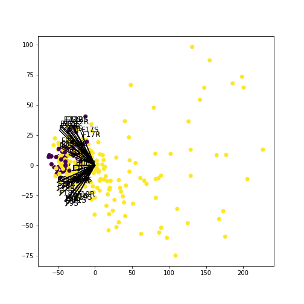
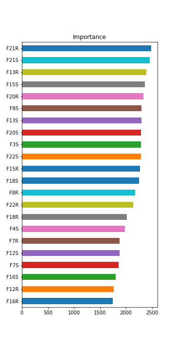

# User Guide

## Biplot

[Biplots](https://en.wikipedia.org/wiki/Biplot) are graphical representations of a data matrix **X** by markers **r<sub>1</sub>,...,r<sub>N</sub>** for its rows and **c<sub>1</sub>,...,c<sub>P</sub>** for its columns, in order to get close to $$x_{ij}\approx r_{i}^\intercal c_{j}$$ 
In a matrix form can be expressed as $$X\approx R{C}^\intercal$$.

To obtain this approximation from the singular value decomposition, if **T=rank(X)** then the factorization of **X** is obtained by

$$X=U\Lambda V^\intercal=\sum_{t=1}^T \lambda_{t}r_{t}c_{t}$$
where **U** is an **N x T** unitary matrix, **Λ** is an **T x T** non-negative real diagonal matrix, and **V** is a **P x T** unitary matrix.
There is a *T-rank* that approximates **X** such as
$$
X \cong U_{(T)} \Lambda_{(T)} V_{(T)}^\intercal=\sum_{t=1}^T \lambda_{t}r_{t}c_{t}
$$
Therefore **R** and **C** are easily obtained as
$$
R=U_{(T)}\Lambda_{(T)}^{\psi} , C=V_{(T)}\Lambda_{(T)}^{1-\psi}
$$

### Example of usage

[Computed Tomography](https://en.wikipedia.org/wiki/CT_scan) is commonly used in daily medical practice as a powerful diagnosis technique. As example we use the well-known [SPECTF UCI ML dataset](https://archive.ics.uci.edu/ml/datasets/SPECTF+Heart) where our main objetiv is to determine whether a patient has an abnormal diagnosis or not.


#### Data preparation
```
import pandas as pd
import numpy as np
from matplotlib import pyplot as plt
from biofes import biplot
from biofes import feature


url1 = "https://archive.ics.uci.edu/ml/machine-learning-databases/spect/SPECTF.train"
url2 = "https://archive.ics.uci.edu/ml/machine-learning-databases/spect/SPECTF.test"
data = pd.read_csv(url1, header=None).append(pd.read_csv(url2, header=None)).reset_index(drop = True)

var_names = ['target','F1R', 'F1S', 'F2R', 'F2S', 'F3R', 'F3S', 'F4R', 'F4S', 'F5R', 'F5S', 'F6R', 'F6S', 'F7R', 'F7S', 'F8R', 
             'F8S', 'F9R', 'F9S', 'F10R', 'F10S', 'F11R', 'F11S', 'F12R', 'F12S', 'F13R', 'F13S', 'F14R', 'F14S', 'F15R', 
             'F15S', 'F16R', 'F16S', 'F17R', 'F17S', 'F18R', 'F18S', 'F19R', 'F19S', 'F20R', 'F20S', 'F21R', 'F21S', 'F22R',
             'F22S']

data.columns = var_names

target = data.target
X = data.drop('target', 1)
```

#### Classical Biplot
```
bip_classic = biplot.Classic(X, dim = 40, alpha = 1, method = 1)
bip_classic.plot()
```



#### Feature Selection
```
T_classic = feature.selection(bip_classic, target, thr_dis = 50, thr_corr = 0.9)
print(T_classic.var_sel)
```

['F3S', 'F4S', 'F7R', 'F7S', 'F8R', 'F8S', 'F12R', 'F12S', 'F13R', 'F13S', 'F15R', 'F15S', 'F16R', 'F16S', 'F18R', 'F18S', 'F20R', 'F20S', 'F21R', 'F21S', 'F22R', 'F22S']

```
T_classic.Disc.loc[T_classic.var_sel,'0-1'].sort_values().plot(kind='barh', figsize= (5,10), title = 'Importance');
```


